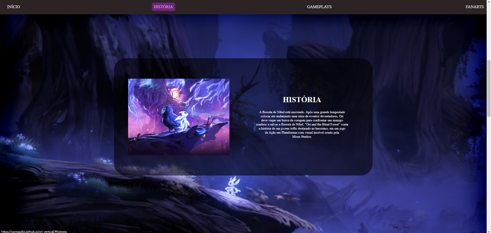

# SITE VERTICAL - ORI

## Sobre 
Site estilo vertical para apresentar o jogo Ori and the blind florest, com sections sobre a historia, fanart e gameplays. Realizado afim de colocar em prática as linguagens de marcação HTML, CSS e Markdown.
___

## Tecnológias utilizadas
- HTML
- CSS
- Markdown
- Git
___

## Autor
LinkedIn -> [Giovanna Coelho](https://www.linkedin.com/in/giovanna-gilio-479505327/)